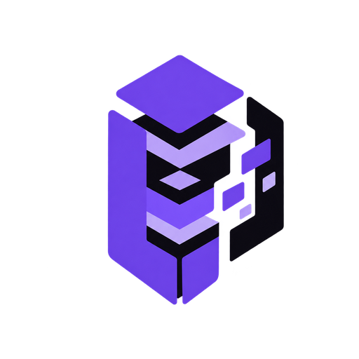
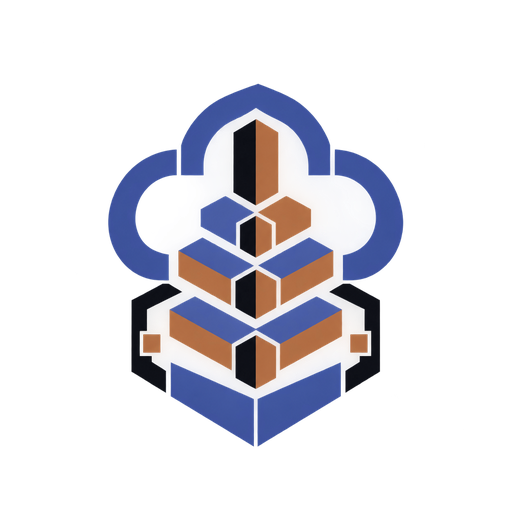
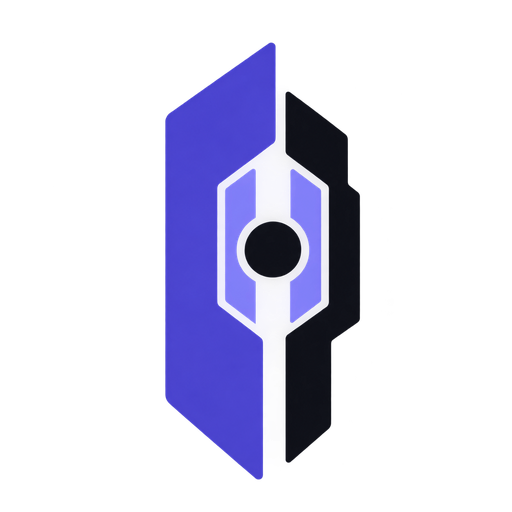
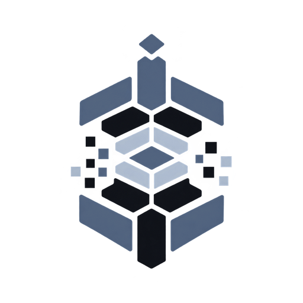

  

  
  
  
  
  

  African cybersecurity training ecosystem — hands-on bootcamps, self-paced courses, and a token-based reward system (CP).

  Explore the <a href="https://github.com/QYVORA/">QYVORA organization</a> for platform repositories, toolchain documentation, and installers.

---

## Tools

A shared security platform: every tool ships a live interactive terminal (<code>qyvora-tui</code>) with the same engine, command model, and capability registry.

### Reconnaissance, Network & Wireless

<table>
  <tr>
    <td align="center">
      <a href="https://github.com/QYVORA/qyvora-anansi">
         
        <b>Anansi</b> 
        Attack surface reconnaissance CLI — subdomain discovery, TLS/header/path auditing, tech-stack detection, takeover, and OSINT. 
        <code>qyvora-anansi</code> ↗
      </a>
    </td>
    <td align="center">
      <a href="https://github.com/QYVORA/qyvora-nzinga">
         
        <b>Nzinga</b> 
        Open-source intelligence CLI — multi-source collection, correlation, evidence-backed findings, and reports. 
        <code>qyvora-nzinga</code> ↗
      </a>
    </td>
  </tr>
  <tr>
    <td align="center">
      <a href="https://github.com/QYVORA/qyvora-toha3ee">
         
        <b>TOHA3EE</b> 
        Modular network security framework — MITM, wireless, switch, auth, web, enumeration, and OSINT modules. 
        <code>qyvora-toha3ee</code> ↗
      </a>
    </td>
    <td align="center">
      <a href="https://github.com/QYVORA/qyvora-mansa">
         
        <b>Mansa</b> 
        Authorized wireless security assessment — WLAN discovery, enumeration, MITM-range analysis, deterministic rules, and transparent risk scoring. 
        <code>qyvora-mansa</code> ↗
      </a>
    </td>
  </tr>
</table>

### Binary, Malware & Fuzzing

<table>
  <tr>
    <td align="center">
      <a href="https://github.com/QYVORA/qyvora-aksum">
         
        <b>Aksum</b> 
        Static binary analysis platform — hardening checks, disassembly, dataflow, and attack-surface aggregation. 
        <code>qyvora-aksum</code> ↗
      </a>
    </td>
    <td align="center">
      <a href="https://github.com/QYVORA/qyvora-sekhmet">
         
        <b>Sekhmet</b> 
        Baseline-aware fuzzing framework — mutation, crash classification, deduplication, minimization, and coverage feedback. 
        <code>qyvora-sekhmet</code> ↗
      </a>
    </td>
  </tr>
  <tr>
    <td align="center">
      <a href="https://github.com/QYVORA/qyvora-kush">
         
        <b>Kush</b> 
        Malware sample analysis — hashes, metadata, static posture, strings, network indicators, IOC extraction, and threat classification. Samples are never executed. 
        <code>qyvora-kush</code> ↗
      </a>
    </td>
    <td></td>
  </tr>
</table>

### Platform, Mobile & Identity

<table>
  <tr>
    <td align="center">
      <a href="https://github.com/QYVORA/qyvora-imhotep">
         
        <b>Imhotep</b> 
        Cloud snapshot security assessment — IAM, storage, network, container, secret, and misconfiguration risk on offline snapshots. Live provider collection is refused. 
        <code>qyvora-imhotep</code> ↗
      </a>
    </td>
    <td align="center">
      <a href="https://github.com/QYVORA/qyvora-jabari">
         
        <b>Jabari</b> 
        Android device security assessment CLI — ADB-based posture analysis, rule-driven findings, and offline reports. 
        <code>qyvora-jabari</code> ↗
      </a>
    </td>
  </tr>
  <tr>
    <td align="center">
      <a href="https://github.com/QYVORA/qyvora-amanirenas">
         
        <b>Amanirenas</b> 
        Mobile app security assessment — offline IPA/profile analysis for metadata, static, configuration, API, and secrets risk. Runtime assessment and live device acquisition are refused honestly. 
        <code>qyvora-amanirenas</code> ↗
      </a>
    </td>
    <td align="center">
      <a href="https://github.com/QYVORA/qyvora-shaka">
         
        <b>Shaka</b> 
        Active Directory security assessment — discovery, enumeration, relationship graphing, posture analysis, and risk scoring. 
        <code>qyvora-shaka</code> ↗
      </a>
    </td>
  </tr>
  <tr>
    <td align="center">
      <a href="https://github.com/QYVORA/qyvora-sundiata">
         
        <b>Sundiata</b> 
        Identity directory security assessment — discovery, enumeration, authentication & MFA posture, credential exposure, privilege mapping, and identity attack paths. Credentials are redacted and never stored. 
        <code>qyvora-sundiata</code> ↗
      </a>
    </td>
    <td></td>
  </tr>
</table>

### Forensics & Incident Response

<table>
  <tr>
    <td align="center">
      <a href="https://github.com/QYVORA/qyvora-timbuktu">
         
        <b>Timbuktu</b> 
        Digital forensics investigation — evidence integrity, artifact, filesystem, memory, timeline, log, and indicator analysis on offline case files. 
        <code>qyvora-timbuktu</code> ↗
      </a>
    </td>
    <td></td>
  </tr>
</table>

---

  Shipped as part of the QYVORA African cybersecurity platform. Every tool follows the same deterministic, refusal-aware assessment model.

